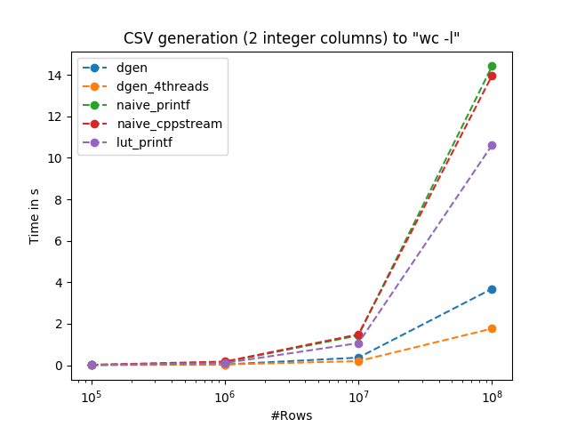
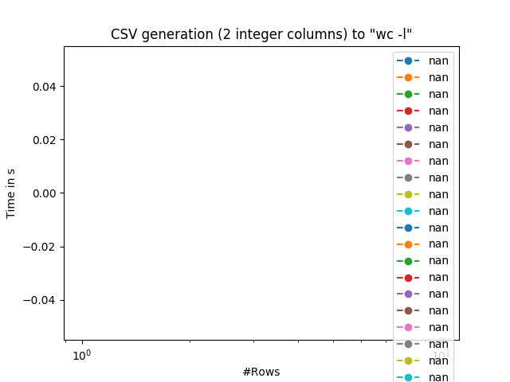

# dgen
dgen is a flexible data generator for testing and benchmarking purpose.
It aims at producing in the desired format quickly and, hence, can be used for generating large amounts of data.

## Performance
This benchmark compares optimized single-threaded naive implementations with dgen. The naive implementations generate integers in the given domain and directly write a row to stdout. Note that the naive implementations are hard-coded for this benchmark and do not allow the generation of arbitrary CSVs. lut_printf replaces the integer to string conversion by a lookup table assuming the domain is small enough (64k).

### Sandy Brdige

### Skylake X

### Results
Observe that single-threaded dgen is a around 2x faster than the naive implementations whereas the parallel version of dgen using 4 threads is another 4x faster while still providing a deterministic output.

For 1 billion records and two integers per record, dgen achieves a throughput around 16M records/s using a single thread. Using 4 threads the throuhput increases to 50M records/s.

## Further information
* [Data specification](SPECIFICATION.md)